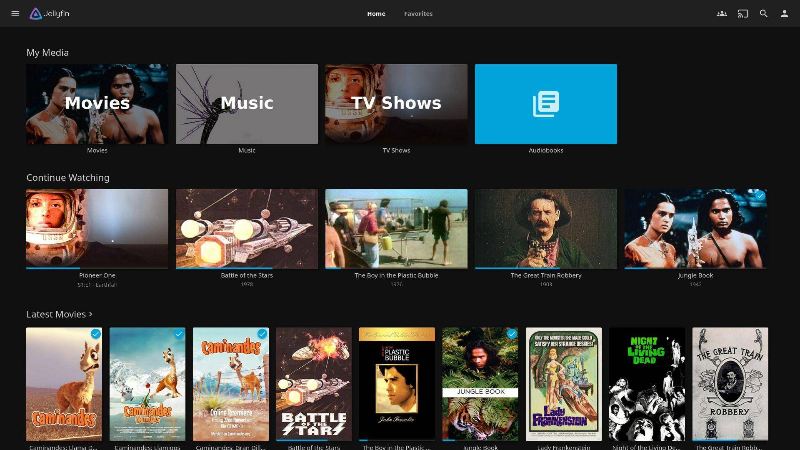

<!--
N.B.: README ini dibuat secara otomatis oleh <https://github.com/YunoHost/apps/tree/master/tools/readme_generator>
Ini TIDAK boleh diedit dengan tangan.
-->

# Jellyfin untuk YunoHost

[](https://ci-apps.yunohost.org/ci/apps/jellyfin/)  

[](https://install-app.yunohost.org/?app=jellyfin)

*[Baca README ini dengan bahasa yang lain.](./ALL_README.md)*

> *Paket ini memperbolehkan Anda untuk memasang Jellyfin secara cepat dan mudah pada server YunoHost.*  
> *Bila Anda tidak mempunyai YunoHost, silakan berkonsultasi dengan [panduan](https://yunohost.org/install) untuk mempelajari bagaimana untuk memasangnya.*

## Ringkasan

Jellyfin enables you to collect, manage, and stream your media. Run the Jellyfin server on your system and gain access to the leading free-software entertainment system, bells and whistles included.


**Versi terkirim:** 10.9.10~ynh1

**Demo:** <https://demo.jellyfin.org/stable/web/index.html>

## Tangkapan Layar




## Dokumentasi dan sumber daya

- Website aplikasi resmi: <https://jellyfin.org>
- Dokumentasi pengguna resmi: <https://jellyfin.org/docs/>
- Depot kode aplikasi hulu: <https://github.com/jellyfin/jellyfin>
- Gudang YunoHost: <https://apps.yunohost.org/app/jellyfin>
- Laporkan bug: <https://github.com/YunoHost-Apps/jellyfin_ynh/issues>

## Info developer

Silakan kirim pull request ke [`testing` branch](https://github.com/YunoHost-Apps/jellyfin_ynh/tree/testing).

Untuk mencoba branch `testing`, silakan dilanjutkan seperti:

```bash
sudo yunohost app install https://github.com/YunoHost-Apps/jellyfin_ynh/tree/testing --debug
atau
sudo yunohost app upgrade jellyfin -u https://github.com/YunoHost-Apps/jellyfin_ynh/tree/testing --debug
```

**Info lebih lanjut mengenai pemaketan aplikasi:** <https://yunohost.org/packaging_apps>
